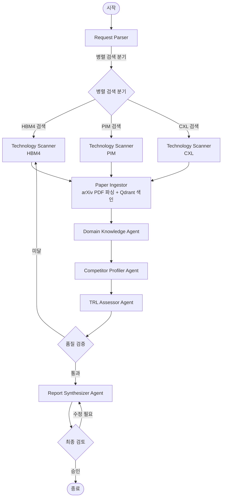
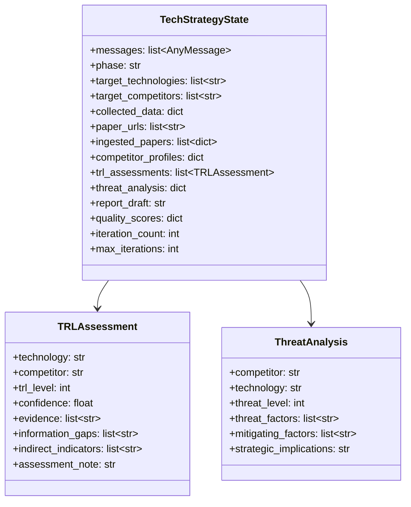
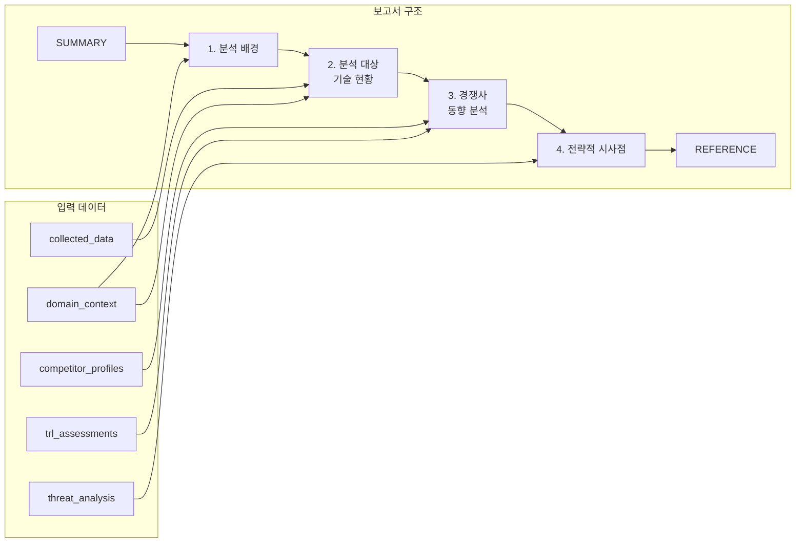

# 반도체 차세대 기술 경쟁 동향의 실시간 분석을 위한 Multi-Agent 기반 기술 전략 보고서 자동 생성 시스템 설계

## Abstract

글로벌 AI 반도체 시장의 급격한 성장과 함께 HBM(High Bandwidth Memory), PIM(Processing-In-Memory), CXL(Compute Express Link)을 중심으로 한 차세대 메모리 기술 경쟁이 심화되고 있다. SK hynix는 HBM3E 세대에서 확보한 기술적 우위를 HBM4 이후 세대까지 지속하기 위해 경쟁사의 연구 방향과 기술 성숙도를 실시간으로 파악해야 하는 전략적 필요성에 직면해 있다. 본 설계 보고서는 이러한 요구에 부응하여, LangGraph 기반 Multi-Agent Agentic Workflow를 활용한 "기술 전략 분석 보고서" 자동 생성 시스템의 설계를 제안한다. 제안 시스템은 오픈소스 LLM과 Tavily Search API를 활용하여 arXiv, Google Scholar, 뉴스 사이트로부터 최근 3개년의 학술 논문 및 기술 정보를 자동 수집하고, 수집된 논문 PDF를 langchain-opendataloader-pdf로 구조적 파싱(1컬럼/2컬럼 본문, 표, 그림 구분)하여 벡터 스토어에 색인한 뒤 RAG 기반 분석을 수행하는 전문 에이전트들을 Distributed(분산 협업) 패턴으로 통합한다. 각 에이전트는 중앙 Supervisor 없이 상호 핸드오프를 통해 자율적으로 협업하며, 경쟁사별 기술 성숙도와 위협 수준을 정량적으로 분석하고, R&D 담당자가 즉시 활용 가능한 전략 보고서를 산출한다. 본 보고서에서는 시스템의 아키텍처, 에이전트 설계, 상태 관리, 제어 전략, 정량적 평가 메트릭을 상세히 기술하고, 예상 결과와 한계점을 논의한다.

---

## 1. Introduction

### 1.1 연구 배경 및 동기

AI 가속기 시장의 폭발적 성장은 고대역폭 메모리 기술의 패러다임 전환을 견인하고 있다. NVIDIA의 H100, H200, B200으로 이어지는 AI 칩 로드맵은 메모리 대역폭과 용량에 대한 전례 없는 수준의 요구를 메모리 제조사에 부과하고 있으며, 이에 따라 HBM 기술은 단순한 제품 카테고리를 넘어 반도체 산업의 전략적 핵심 축으로 부상하였다. SK hynix는 HBM 초기 세대부터 일관된 first-mover 전략을 통해 HBM3E 세대에서 세계 시장 점유율 1위를 달성하였으나, Samsung과 Micron이 HBM4 세대를 기점으로 차별화된 기술 전략을 전개하고 있어 경쟁 구도의 변화가 예상된다.

Samsung은 1c DRAM과 4nm 로직 베이스 다이를 결합한 HBM4를 세계 최초로 상용 출하하였다고 발표하며 기술 리더십 탈환을 시도하고 있다. 해당 제품은 2,048개의 I/O 핀을 통해 최대 3,300 GB/s의 대역폭을 달성하며, 이전 세대 대비 2.7배의 처리량 향상과 40%의 전력 효율 개선을 주장하고 있다. Micron 역시 NVIDIA Vera Rubin 플랫폼과의 통합을 목표로 HBM4 양산을 개시하였으며, 동일 용량 및 적층 구조 기준 HBM3E 대비 2.3배의 대역폭 향상을 달성하였다고 공표하였다. 이러한 경쟁 환경에서 특허 출원, 논문 발표, 파트너십 체결 등의 공개 정보가 쏟아지고 있으나, 이를 체계적으로 수집하고 분석하여 전략적 시사점을 도출하는 과정은 여전히 수동적이고 비효율적인 방식에 의존하고 있다.

더 나아가, HBM 기술 경쟁은 메모리 적층 기술에 국한되지 않는다. PIM 기술은 데이터 이동 병목(data movement bottleneck)을 근본적으로 해결하여 AI 추론 워크로드의 에너지 효율을 혁신적으로 개선할 잠재력을 보유하고 있으며, CXL 기반 메모리 확장 기술은 GPU 및 서버 메모리 한계를 초월하는 유연한 메모리 인프라를 가능케 한다. SK hynix는 AiMX(GDDR6-AiM 기반 PIM 가속기)와 CMM-DDR5(CXL 2.0 기반 메모리 모듈)를 이미 출시하였으나, 해당 기술들의 시장 표준 확립과 상용화는 여전히 초기 단계에 머물러 있어 경쟁사의 동향을 면밀히 추적해야 할 필요성이 존재한다.

### 1.2 문제 정의

본 프로젝트가 해결하고자 하는 핵심 문제는 다음과 같이 정의된다. 반도체 R&D 담당자가 경쟁사의 기술 전략과 연구 방향을 파악하기 위해서는 특허 데이터베이스, 학술 논문, 뉴스, 기업 공시, 채용 공고 등 다양한 출처의 비정형 정보를 수동으로 수집하고, 이를 TRL(Technology Readiness Level) 프레임워크에 기반하여 각 기술의 성숙도를 평가하며, 최종적으로 경쟁사별 위협 수준을 종합 판단하여 전략적 시사점을 도출해야 한다. 이 과정은 고도의 도메인 전문성과 상당한 시간 투입을 필요로 하며, 정보의 실시간성(timeliness)과 포괄성(comprehensiveness) 사이에 근본적인 트레이드오프가 존재한다.

특히 TRL 4~6 수준의 기술 정보, 즉 수율(yield), 공정 파라미터(process parameter), 실제 성능 수치 등은 핵심 영업 비밀에 해당하여 공개 정보만으로는 정확한 평가가 불가능하다는 본질적 한계가 있다. 따라서 시스템은 이러한 정보 비대칭(information asymmetry)을 명시적으로 인정하면서도, 간접 지표(특허 출원 패턴, 학회 발표 빈도 변화, 채용 공고 키워드 분석, 공급 계약 발표 등)를 근거로 합리적 추정을 수행할 수 있어야 한다.

### 1.3 목표 및 과업

본 프로젝트의 최종 목표는 HBM4, PIM, CXL 등 차세대 반도체 핵심 기술에 대한 경쟁사(Samsung, Micron)의 최신 R&D 동향을 자동으로 수집 및 분석하여, SK hynix R&D 담당자가 즉시 활용 가능한 "기술 전략 분석 보고서"를 생성하는 AI Agentic Workflow 시스템을 설계 및 구현하는 것이다. 이해관계자는 SK hynix의 R&D 담당자이며, 해당 담당자는 "경쟁사가 지금 정확히 무엇을 연구하고 있는지"를 실시간으로 파악할 수 있어야 한다.

구체적 과업으로는 첫째, 웹 기반 실시간 정보 수집 파이프라인 구축, 둘째, 경쟁사별 기술 프로파일 구성 및 TRL 기반 성숙도 평가, 셋째, 위협 수준 정량 분석 및 전략적 시사점 도출, 넷째, SUMMARY, 분석 배경, 기술 현황, 경쟁사 동향, 전략적 시사점, REFERENCE를 포함하는 구조화된 보고서 자동 생성이 포함된다.

### 1.4 보고서의 구성

본 설계 보고서의 나머지 부분은 다음과 같이 구성된다. 제2장에서는 본 시스템에 적용되는 핵심 기술인 Multi-Agent 아키텍처, RAG(Retrieval-Augmented Generation), 웹 검색 통합, 워크플로우 제어 전략을 기술하고 각 기술의 선정 근거를 논의한다. 제3장에서는 시스템의 구체적 적용 방법을 State 정의, Graph 흐름, 에이전트별 세부 구현 수준에서 상세히 기술한다. 제4장에서는 시스템의 예상 결과를 산출물 형태와 품질 관점에서 서술하고, 제5장에서는 결론과 향후 확장 계획을 제시한다.

---

## 2. 관련 기술 및 구조 설계

### 2.1 Multi-Agent 분산 아키텍처

#### 2.1.1 선정 근거

반도체 기술 전략 분석 보고서의 생성 과정은 본질적으로 다단계(multi-step)이며, 각 단계가 요구하는 역량(capability)이 상이하다. 정보 수집 단계에서는 웹 검색과 문서 파싱 능력이, 기술 분석 단계에서는 반도체 도메인 지식과 TRL 평가 프레임워크에 대한 이해가, 보고서 생성 단계에서는 구조화된 문서 작성 능력이 각각 요구된다. 단일 에이전트로 이 모든 역량을 수행하는 것은 프롬프트의 복잡도 증가로 인한 성능 저하, 토큰 컨텍스트 한계 초과, 디버깅 및 유지보수의 어려움 등 다수의 문제를 야기한다.

Multi-Agent 아키텍처는 이러한 문제를 역할 분리(separation of concerns) 원칙에 기반하여 해결한다. 각 에이전트는 명확히 정의된 단일 책임(single responsibility)을 수행하며, 에이전트 간의 상호작용은 공유 상태(shared state)와 메시지 패싱(message passing)을 통해 조율된다. LangGraph 프레임워크는 이러한 Multi-Agent 시스템의 구현을 위해 StateGraph, Node, Edge, Conditional Edge, Command 기반 핸드오프 등의 추상화를 제공하며, 특히 Distributed(분산 협업) 패턴을 통해 에이전트 간의 직접적 핸드오프와 자율적 제어 흐름을 구현할 수 있다.

본 시스템에서 Multi-Agent 분산 아키텍처를 채택한 핵심 이유는 세 가지이다. 첫째, 기술 영역(HBM4, PIM, CXL)과 분석 관점(기술 현황, 경쟁사 동향, TRL 평가)의 조합으로 인해 탐색 공간이 매우 넓어, 병렬 처리(parallelization)를 통한 효율성 확보가 필수적이다. 둘째, 각 에이전트의 프롬프트를 도메인 특화(domain-specific)로 설계함으로써 LLM의 추론 정확도를 극대화할 수 있다. 셋째, 개별 에이전트의 독립적 테스트와 교체가 가능하여 시스템의 점진적 개선이 용이하다.

그러나 Multi-Agent 아키텍처를 채택한다고 하여 무조건적으로 복잡한 설계를 수용하는 것은 아니다. 실제로 retrieval이나 in-context examples를 활용한 단일 LLM 호출만으로도 상당수의 분석 작업을 수행할 수 있으며, 에이전트 수가 증가할수록 latency와 cost가 함께 증가한다는 현실적 제약이 존재한다. 본 시스템에서 6개의 에이전트를 도출한 것은 기술적 세련됨의 추구가 아니라, 정보 수집/도메인 분석/TRL 평가/보고서 생성이라는 서로 다른 역량이 요구되는 과업의 구조를 분석한 결과이다. 설계 과정에서는 "이 에이전트를 합칠 수 있는가? 합치면 성능이 저하되는가?"를 반복적으로 검증하였으며, 합치면 프롬프트가 비대해지거나 역할 간 간섭이 발생하는 경우에만 분리를 유지하였다. 각 에이전트 내부의 로직은 가능한 한 단순하게 유지하고, 에이전트 간 상호작용 경로를 최소화하되, 문제의 구조가 실제로 요구하는 수준에서만 복잡성을 허용하는 것이 본 설계의 기본 방침이다.

#### 2.1.2 Distributed(분산 협업) 패턴의 적용

본 시스템은 Distributed 패턴을 핵심 제어 구조로 채택한다. Distributed 패턴에서 각 에이전트는 중앙 Supervisor 없이 상호 간 직접 핸드오프(handoff)를 통해 제어를 전달하며, 각자가 보유한 도메인 전문성에 기반하여 후속 에이전트로의 전환을 자율적으로 결정한다. LangGraph에서는 Command(goto="next_agent") 객체를 통해 이러한 에이전트 간 직접 핸드오프를 구현한다.

Supervisor 패턴 대신 Distributed 패턴을 선택한 이유는 본 시스템의 워크플로우 특성에 기인한다. 본 시스템의 데이터 흐름은 검색 → 논문 수집 → 도메인 보강 → 프로파일링 → TRL 평가 → 보고서 생성이라는 비교적 명확한 파이프라인 구조를 형성하며, 각 에이전트는 자신의 후속 단계가 무엇인지를 사전에 알 수 있다. Supervisor 패턴에서는 모든 에이전트 간 전환이 중앙 Supervisor를 경유해야 하므로, 에이전트 수 $N$에 대해 최소 $N$회의 추가 LLM 라우팅 호출이 발생한다. 오픈소스 모델을 로컬에서 구동하는 본 시스템의 환경에서 이러한 불필요한 추론 오버헤드는 전체 응답 지연(latency)을 직접적으로 증가시킨다. Distributed 패턴은 각 에이전트가 직접 후속 에이전트로 제어를 전달하므로 라우팅 오버헤드가 0이며, 파이프라인 구조의 워크플로우에서 가장 효율적인 제어 방식이다. 아울러, 각 에이전트의 내부 로직에 품질 검증과 조건부 분기를 내재시킬 수 있어, 별도의 중앙 판단자 없이도 자기 교정(self-correction) 루프를 구현할 수 있다.

### 2.2 Retrieval-Augmented Generation (RAG)

#### 2.2.1 선정 근거

반도체 기술 분석에 필요한 도메인 지식은 크게 두 가지 범주로 구분된다. 첫째는 TRL 프레임워크, HBM 기술 스펙, 반도체 공정 기초 이론 등 비교적 안정적인(static) 배경 지식이며, 둘째는 경쟁사의 최신 발표, 특허 출원, 뉴스 등 실시간으로 갱신되는(dynamic) 정보이다. LLM의 사전 학습 데이터(pre-training data)는 학습 시점 이후의 정보를 포함하지 않으며, 특히 반도체 산업처럼 기술 변화 속도가 빠른 영역에서는 모델의 parametric knowledge만으로는 정확한 분석이 불가능하다.

RAG는 이러한 한계를 외부 지식 소스로부터의 검색(retrieval)과 LLM의 생성(generation)을 결합함으로써 해결한다. 본 시스템에서 RAG는 두 가지 역할을 수행한다. 첫째는 TRL 9단계의 정의와 판정 기준, HBM/PIM/CXL 기술의 기본 아키텍처와 성능 지표, SK hynix의 기존 제품 포트폴리오 등 안정적 배경 지식의 제공이다. 둘째는 웹 검색을 통해 실시간으로 발견된 arXiv 논문의 PDF를 자동으로 다운로드/파싱하여 벡터 스토어에 동적으로 색인함으로써, 최신 학술 연구 결과를 분석 컨텍스트에 즉시 반영하는 것이다. 이를 통해 벡터 스토어는 사전 구축된 정적 지식과 실행 중 수집된 동적 지식을 통합적으로 보유하게 된다.

#### 2.2.2 벡터 스토어 구성 및 검색 전략

본 시스템의 RAG 파이프라인은 정적 문서 색인과 동적 논문 수집을 통합하는 이중 구조로 설계된다.

**문서 파싱 및 색인 파이프라인.** 학술 논문 PDF의 파싱에는 OpenDataLoader의 langchain-opendataloader-pdf 파이프라인을 채택한다. langchain-opendataloader-pdf는 최신 PDF 추출 벤치마크에서 읽기 순서(reading order), 표(table), 제목(heading) 추출 정확도를 종합한 overall 점수 0.907로 1위를 기록한 오픈소스 PDF 파서로서, 1컬럼(single-column)과 2컬럼(double-column) 레이아웃을 자동으로 식별하고, 본문 텍스트, 표, 그림 캡션, 수식을 구분하여 구조화된 형태로 추출한다. 이는 반도체 분야 논문이 일반적으로 IEEE 2컬럼 형식을 따르며, 성능 비교표와 공정 다이어그램이 분석의 핵심 정보를 담고 있다는 점에서 중요하다. 기존 PyMuPDFLoader 등의 범용 PDF 파서는 컬럼 구분 없이 텍스트를 순차 추출하므로, 2컬럼 논문에서 좌측 컬럼과 우측 컬럼의 텍스트가 뒤섞이는 문제가 빈번하게 발생한다. langchain-opendataloader-pdf는 레이아웃 분석 모델과 수식 인식 모델을 통합한 하이브리드 파이프라인을 내장하여 이 문제를 해결하며, 표를 Markdown 형식으로 변환하여 후속 LLM 분석에서의 활용성을 높인다.

텍스트 분할(chunking)에는 RecursiveCharacterTextSplitter를 사용하되, langchain-opendataloader-pdf가 추출한 구조 정보를 활용하여 섹션 경계(section boundary)를 존중하는 분할을 수행한다. chunk size는 1,000 토큰, overlap은 200 토큰으로 설정하며, 표와 그림 캡션은 별도의 청크로 분리하여 해당 컨텍스트가 온전히 보존되도록 한다.

**임베딩 및 벡터 스토어.** 임베딩 모델로는 오픈소스 모델인 BAAI/bge-m3을 채택한다. BGE-M3은 다국어(multilingual) 지원과 최대 8,192 토큰의 긴 컨텍스트를 처리할 수 있는 임베딩 모델로서, 한국어와 영어가 혼재하는 반도체 기술 문서의 특성에 적합하다. sentence-transformers 라이브러리를 통해 로컬에서 구동하므로 외부 API 의존성이 없다. 벡터 스토어로는 Qdrant를 채택하며, 문서 규모가 수백~수천 건 수준으로 인메모리 검색의 저지연 특성이 에이전트의 실시간 참조 요구에 부합하기 때문이다. 검색 시에는 Relevance Score Threshold를 0.7로 설정하여 관련성이 낮은 문서의 유입을 방지하고, 상위 k=5개의 문서를 반환하도록 구성한다.

**검색 품질 보증.** 검색 품질을 보장하기 위해 Corrective RAG 패턴을 적용한다. 검색된 문서의 관련성을 LLM이 이진(binary) 평가하여, 관련 문서가 부족할 경우 질의를 재작성(query rewrite)한 뒤 재검색을 수행하고, 그래도 충분한 문서를 확보하지 못하면 웹 검색으로 폴백(fallback)한다. 이러한 자기 교정 메커니즘은 RAG의 검색 실패로 인한 환각(hallucination) 위험을 효과적으로 완화한다.

### 2.3 웹 검색 통합 (Web Search Integration)

#### 2.3.1 선정 근거

실시간 경쟁사 동향 파악이라는 본 시스템의 핵심 요구사항을 충족하기 위해서는 웹 검색 기능이 필수적이다. 경쟁사의 최신 제품 발표, 특허 출원 정보, 학회 발표, 파트너십 체결, 채용 공고 등은 웹에 실시간으로 공개되는 정보이며, 이러한 정보는 사전에 벡터 스토어에 색인하는 것이 불가능하다. 따라서 RAG가 안정적 배경 지식을 제공하는 역할을 담당한다면, 웹 검색은 최신 동향 정보의 실시간 수집을 담당하는 상호 보완적 관계를 형성한다.

#### 2.3.2 검색 도구 및 전략

본 시스템은 웹 검색 도구로 Tavily Search API를 채택한다. Tavily는 LLM 에이전트를 위해 설계된 검색 API로서, 구조화된 결과 반환, 콘텐츠 추출(content extraction) 내장, 도메인 필터링(include_domains), 시간 범위 제한 등의 기능을 제공한다. LangChain 생태계에서 langchain_tavily 패키지를 통해 네이티브 통합이 지원되며, TavilySearch 도구로 에이전트의 tool로 직접 바인딩이 가능하다.

**도메인 필터링 및 시간 범위 제한.** 본 시스템에서 Tavily Search는 include_domains 파라미터를 활용하여 검색 대상을 세 가지 도메인 카테고리로 제한한다. 첫째, 학술 논문 소스로서 arXiv(arxiv.org)와 Google Scholar(scholar.google.com)를 지정한다. 둘째, 산업 뉴스 소스로서 주요 반도체 전문 매체(semianalysis.com, eetimes.com, tomshardware.com)와 일반 뉴스(reuters.com, bloomberg.com)를 포함한다. 셋째, 기업 공식 소스로서 Samsung Semiconductor(semiconductor.samsung.com), Micron(micron.com), SK hynix(skhynix.com) 공식 사이트를 지정한다. 시간 범위는 최근 3개년으로 제한하여, Tavily의 days 파라미터를 1,095일(365 × 3)로 설정함으로써 오래된 정보의 유입을 차단한다.

**arXiv 논문 자동 수집 파이프라인.** 웹 검색 결과에서 arXiv 논문이 식별되면, 다음의 자동화된 수집 파이프라인이 작동한다. 먼저 Tavily 검색 결과에서 arXiv 논문의 abstract 페이지 URL(예: arxiv.org/abs/2405.xxxxx)을 추출한다. 해당 URL에서 논문 ID를 파싱하여 PDF 다운로드 URL(예: arxiv.org/pdf/2405.xxxxx)을 구성하고, PDF를 다운로드한다. 다운로드된 PDF는 langchain-opendataloader-pdf를 통해 구조적으로 파싱되며, 1컬럼/2컬럼 본문, 표, 그림 캡션이 구분되어 추출된다. 파싱된 텍스트는 청킹 후 BGE-M3 임베딩을 거쳐 Qdrant 벡터 스토어에 동적으로 색인된다. 이를 통해 후속 분석 에이전트가 RAG를 통해 논문의 구체적 실험 결과, 성능 수치, 방법론을 직접 참조할 수 있게 된다.

Google Scholar 결과의 경우, Tavily가 반환한 검색 결과에서 논문 제목과 저자 정보를 추출한 뒤, arXiv에 해당 논문의 오픈 액세스 버전이 존재하는지를 2차 검색으로 확인한다. arXiv 버전이 확인되면 동일한 PDF 수집 파이프라인을 적용하고, 오픈 액세스 버전이 없는 경우에는 Tavily가 추출한 abstract와 메타데이터만을 활용한다.

**다층적 검색 전략.** 검색은 기술 영역별/경쟁사별로 다층적(multi-layered)으로 수행된다. 1차 검색에서는 기술 키워드와 경쟁사명을 조합하여 각 도메인 카테고리에 대한 쿼리를 구성한다. 2차 검색에서는 1차 결과에서 식별된 구체적 제품명, 프로젝트 코드명, 연구자명 등을 활용하여 심화 검색을 수행한다. 이러한 iterative deepening 전략은 초기 검색의 재현율(recall)과 심화 검색의 정밀도(precision)를 동시에 확보하는 데 효과적이다.

### 2.4 워크플로우 설계

#### 2.4.1 제어 전략 (Control Strategy)

본 시스템의 워크플로우 제어 전략은 단일 패턴에 의존하지 않고, 문제의 각 층위에 적합한 제어 방식을 조합하는 하이브리드 접근을 채택한다. 이러한 설계가 도출된 과정을 이해하기 위해서는 각 패턴이 언제 효과적인지를 먼저 살펴볼 필요가 있다.

Prompt chaining은 작업을 명확하게 고정된 하위 작업들로 분해할 수 있는 상황에 적합하며, LLM 호출을 더 단순한 작업으로 나눔으로써 latency를 감수하더라도 더 높은 정확도를 확보할 수 있다. 본 시스템에서 Phase 1(정보 수집) → Phase 2(프로파일링) → Phase 3(TRL 평가) → Phase 4(보고서 생성)의 순차적 전환은 prompt chaining의 직접적 적용이다. 각 Phase의 산출물이 다음 Phase의 입력이 되는 명확한 의존 관계가 존재하므로, 이 수준의 순차성은 문제의 구조에 내재된 것이지 설계에 의해 인위적으로 부과된 것이 아니다.

Parallelization은 하위 작업들이 상호 독립적으로 실행 가능할 때 속도를 높이거나, 여러 관점의 반복 시도를 통해 더 높은 신뢰도의 결과가 필요할 때 효과적이다. Phase 1에서 HBM4, PIM, CXL 세 기술 영역에 대한 동시 검색은 sectioning 방식의 병렬화에 해당한다. 각 기술 영역의 검색은 상호 독립적이므로 병렬 실행이 자연스러우며, 이를 통해 전체 정보 수집 시간을 약 1/3로 단축할 수 있다. 아울러, 동일 기술에 대해 학술 논문 도메인과 산업 뉴스 도메인을 동시에 검색하는 것은 서로 다른 관점에서의 정보 수집을 통해 포괄성을 높이는 voting 방식의 병렬화와 유사한 효과를 갖는다.

Orchestrator-workers 패턴은 필요한 하위 작업의 종류와 수를 사전에 완전히 예측하기 어려운 경우에 적합한 패턴이나, 본 시스템의 워크플로우는 검색 대상 기술 영역과 경쟁사가 사전에 정의되므로 이 패턴의 동적 작업 생성 기능은 필요하지 않다. 대신 본 시스템은 기술 영역별 병렬 검색을 LangGraph의 Send 메커니즘으로 구현하는 정적 병렬화 방식을 채택하여, 불필요한 중앙 조율 오버헤드 없이 효율적인 병렬 처리를 달성한다.

Evaluator-optimizer 패턴은 명확한 평가 기준이 존재하고, 반복적인 개선을 통해 측정 가능한 품질 향상이 확인될 때 효과적이다. 본 시스템의 FinalReview → Report Synthesizer 피드백 루프와, QualityCheck → Technology Scanner 재수집 루프는 이 패턴의 직접적 적용이다. Distributed 패턴에서는 이러한 피드백 루프가 중앙 Supervisor를 경유하지 않고, 평가 노드에서 직접 해당 에이전트로 핸드오프하므로 라우팅 오버헤드가 제거된다. 이 패턴이 본 시스템에 적합한지를 판단하는 기준은 두 가지인데, 첫째 사람이 피드백을 제공하면 LLM 응답이 실제로 더 나아지는 경우, 둘째 LLM 자체가 유의미한 피드백을 생성할 수 있는 경우이다. 기술 전략 보고서는 구조적 완성도, 근거 제시 여부, 논리적 일관성 등 명확하게 정의 가능한 평가 기준을 보유하고 있으므로, 두 조건 모두를 충족한다.

이상의 패턴 조합을 종합하면, 본 시스템의 워크플로우는 전체 수준에서는 prompt chaining(Phase 간 순차 전환)을, Phase 내부에서는 parallelization(독립 작업 동시 실행)을, 품질 보증 단계에서는 evaluator-optimizer(생성-평가-수정 루프)를 적용하는 계층적 구조(layered structure)를 형성하며, 이 전체를 Distributed 패턴의 직접 핸드오프로 연결한다.

구체적으로, 워크플로우는 4개의 주요 Phase로 구성된다. Phase 1(정보 수집)에서는 기술 영역별 병렬 웹 검색과 RAG 검색이 수행된다. Phase 2(경쟁사 프로파일링)에서는 수집된 정보를 경쟁사별로 재구성하고 기술 포트폴리오를 정리한다. Phase 3(TRL 평가 및 위협 분석)에서는 각 기술에 대한 경쟁사별 TRL을 추정하고, 위협 수준을 정량화한다. Phase 4(보고서 생성)에서는 앞선 분석 결과를 종합하여 구조화된 기술 전략 분석 보고서를 생성한다.

각 Phase 간의 전환은 에이전트 간 직접 핸드오프와 conditional edge를 통해 제어되며, Phase 완료 조건(completion criteria)이 충족될 때만 다음 Phase로 진행한다. Phase 완료 조건에는 수집된 정보의 최소 건수, 경쟁사별 프로파일의 완성도, TRL 평가의 일관성 등이 포함된다. 이러한 완료 조건의 명시적 설정은 evaluator-optimizer 루프의 무한 반복을 방지하면서도, 불충분한 결과가 후속 단계로 전파되는 것을 차단하는 이중 안전 장치로 기능한다.

#### 2.4.2 에이전트 정의

본 시스템은 총 6개의 에이전트로 구성되며, 각 에이전트의 역할, 입력, 출력, 사용 도구를 다음과 같이 정의한다.

**Request Parser (요청 파서)**는 시스템의 진입점(entry point)으로서, 사용자의 분석 요청을 파싱하여 분석 대상 기술 영역과 경쟁사를 식별하고, 초기 상태(target_technologies, target_competitors)를 설정한다. 이 노드는 LLM 추론을 수행하지 않는 경량 유틸리티 노드로서, 상태 초기화 후 즉시 Technology Scanner Agent로 제어를 핸드오프한다. Distributed 패턴에서는 중앙 Supervisor가 존재하지 않으므로, 각 에이전트가 자신의 작업 완료 후 직접 후속 에이전트로 제어를 전달한다.

**Technology Scanner Agent (기술 스캐너 에이전트)**는 Tavily Search API를 활용하여 지정된 기술 영역(HBM4, PIM, CXL)에 대한 최신 정보를 수집한다. 검색 대상은 arXiv, Google Scholar, 산업 뉴스, 기업 공식 사이트로 도메인 필터링되며, 시간 범위는 최근 3개년으로 제한된다. 수집된 결과는 출처(source), 발행일(date), 핵심 내용(summary), 관련 기술(technology), 관련 기업(company) 필드를 포함하는 구조화된 형식으로 정리된다. 해당 에이전트는 기술 영역별로 병렬 실행이 가능하도록 설계되며, LangGraph의 Send 메커니즘을 통해 동시 다발적 검색을 수행한다. 검색 결과에서 arXiv 논문이 식별되면, 해당 논문 정보를 Paper Ingestor 노드로 전달하여 PDF 수집 파이프라인을 트리거한다.

**Paper Ingestor (논문 수집 노드)**는 Technology Scanner가 식별한 arXiv 논문의 PDF를 다운로드하고, langchain-opendataloader-pdf를 통해 구조적으로 파싱한 후, BGE-M3 임베딩을 거쳐 Qdrant 벡터 스토어에 색인하는 유틸리티 노드이다. 1컬럼/2컬럼 레이아웃 식별, 표/그림 캡션 분리, 섹션 경계 존중 청킹을 수행하여 학술 논문의 구조적 특성을 보존한다. 이 노드는 LLM 추론을 수행하지 않는 결정론적(deterministic) 처리 노드로서, 처리 완료 후 Domain Knowledge Agent로 제어를 핸드오프한다.

**Domain Knowledge Agent (도메인 지식 에이전트)**는 RAG 파이프라인을 활용하여 벡터 스토어에 사전 색인된 배경 지식을 검색하고 제공한다. TRL 프레임워크의 각 단계에 대한 상세 정의, HBM/PIM/CXL 기술의 기본 아키텍처와 성능 지표, SK hynix의 기존 제품 스펙과 로드맵 정보 등이 이 에이전트의 주요 검색 대상이다. Corrective RAG 패턴을 내재하여 검색 결과의 관련성을 자체 평가하고, 필요 시 질의를 재구성하거나 웹 검색으로 폴백한다.

**Competitor Profiler Agent (경쟁사 프로파일러 에이전트)**는 Technology Scanner Agent와 Domain Knowledge Agent가 수집한 정보를 경쟁사별로 재구성하여 체계적인 기술 프로파일을 생성한다. 각 경쟁사의 기술 포트폴리오, 최근 발표 이력, 파트너십 현황, 추정 기술 로드맵을 종합적으로 정리하며, 특히 간접 지표(특허 출원 패턴, 학회 발표 빈도, 채용 공고 키워드)를 활용한 기술 방향성 추론을 수행한다. 이 에이전트의 산출물은 후속 TRL 평가의 핵심 입력이 된다.

**TRL Assessor Agent (TRL 평가 에이전트)**는 Competitor Profiler Agent가 생성한 경쟁사별 기술 프로파일과 Domain Knowledge Agent가 제공하는 TRL 프레임워크 정의를 기반으로, 각 기술에 대한 경쟁사별 TRL을 추정한다. 이 에이전트는 Pydantic 기반의 구조화된 출력(structured output)을 생성하며, TRL 수치, 추정 근거, 신뢰도(confidence level), 정보 공백(information gap) 명시를 포함한다. 특히 TRL 4~6 구간의 추정에 대해서는 간접 지표에 기반한 추론임을 명시적으로 표시하여 보고서의 신뢰성을 확보한다. 아울러, 경쟁사별 위협 수준(threat level)을 5점 척도로 정량화하고, 위협 요인과 완화 요인을 함께 기술한다.

**Report Synthesizer Agent (보고서 합성 에이전트)**는 앞선 모든 에이전트의 산출물을 종합하여 최종 "기술 전략 분석 보고서"를 생성한다. 보고서는 SUMMARY, 분석 배경, 분석 대상 기술 현황, 경쟁사 동향 분석, 전략적 시사점, REFERENCE의 구조를 따르며, 각 섹션은 R&D 담당자가 즉시 의사결정에 활용할 수 있는 수준의 구체성과 실행 가능성(actionability)을 갖추도록 작성된다.

각 에이전트의 설계에서 가장 중요한 것은 역할(role)과 목표(goal)의 명확한 정의이다. 에이전트가 무엇을 할 것인지, 누구를 위해 작동하는지, 어떤 형태의 출력을 생성할 것인지가 시스템 프롬프트 수준에서 명시되지 않으면, 탐색 공간이 지나치게 넓어져 불필요한 행동을 시도하거나 역할 범위를 초과하는 결과를 생성하게 된다.

#### 2.4.2.1 도구 설계 원칙

에이전트의 성능은 프롬프트뿐 아니라, 에이전트가 사용하는 도구(tool)의 인터페이스 품질에 크게 좌우된다. LLM은 사람과 마찬가지로 모호한 인터페이스에서 실수할 확률이 높아지므로, 도구를 설계할 때는 "잘못 사용하기 어렵게" 만드는 것이 핵심이다.

본 시스템에서는 이 원칙을 다음과 같이 구체화한다. Technology Scanner Agent의 검색 도구에서 날짜 범위 파라미터는 ISO 8601 형식(YYYY-MM-DD)으로 고정하여 날짜 형식 혼용을 원천적으로 차단한다. TRL Assessor Agent의 출력에서 trl_level은 1~9 범위의 정수로, confidence는 0.0~1.0 범위의 부동소수점으로, assessment_basis는 "direct" 또는 "indirect"만 허용하는 열거형으로 각각 타입을 제한하여, LLM이 범위를 벗어나거나 모호한 표현을 생성할 여지를 제거한다. 도구 간 용도 구분이 명확해야 하는 점도 중요한데, Tavily Search의 도메인 필터링 파라미터를 활용하여 학술 논문 검색(예: include_domains=["arxiv.org", "scholar.google.com"])과 산업 뉴스 검색(예: include_domains=["eetimes.com", "reuters.com"])을 별도의 도구 호출로 분리함으로써, LLM이 각 도구의 용도를 혼동하지 않도록 안내한다.

#### 2.4.3 평가 기준

시스템의 산출물 품질을 검증하기 위한 평가 기준은 전량 주관 평가를 배제하고, 모든 항목을 자동 계산 가능한 정량적 메트릭으로 설계한다.

**정보 수집 품질 메트릭.**

| 메트릭 | 정의 | 목표값 |
|--------|------|--------|
| Source Coverage Rate (SCR) | (수집된 고유 출처 수) / (기대 출처 수) × 100 | ≥ 80% |
| Domain Precision (DP) | (대상 도메인 출처 수) / (전체 수집 출처 수) × 100 | ≥ 90% |
| Temporal Compliance Rate (TCR) | (최근 3년 이내 출처 수) / (전체 출처 수) × 100 | ≥ 85% |
| Paper Ingestion Success Rate | (파싱 성공 PDF 수) / (다운로드 시도 PDF 수) × 100 | ≥ 90% |
| Technology Coverage Matrix | (정보 존재 셀 수) / (기술영역 × 경쟁사 전체 셀 수) × 100 | = 100% |

**RAG 품질 메트릭.**

| 메트릭 | 정의 | 목표값 |
|--------|------|--------|
| Retrieval Hit Rate | 검색 쿼리 중 relevance score ≥ 0.7인 문서를 1건 이상 반환한 비율 | ≥ 90% |
| Context Precision@5 | 상위 5개 반환 문서 중 관련 문서 비율 (ground-truth 기반) | ≥ 0.70 |
| Embedding Cosine Similarity | 쿼리-문서 임베딩 간 코사인 유사도 평균 | ≥ 0.75 |
| Corrective RAG Fallback Rate | 웹 검색 폴백이 트리거된 비율 (낮을수록 좋음) | ≤ 15% |

**TRL 평가 정확도 메트릭.**

| 메트릭 | 정의 | 목표값 |
|--------|------|--------|
| TRL MAE | \|\|\ucd94\uc815 TRL - \uc804\ubb38\uac00 \ud310\uc815 TRL\|\| \uc758 \ud3c9\uade0 | ≤ 1.0 |
| TRL 방향 일치율 | 추정 TRL의 상대적 순서가 전문가 판정과 일치하는 비율 | ≥ 80% |
| Evidence Density | TRL 평가 건당 근거 항목 수 | ≥ 3개 |
| Confidence Calibration Error | \|\|\ud3c9\uade0 confidence - \uc2e4\uc81c \uc815\ud655\ub960\|\| | ≤ 0.10 |
| Information Gap Disclosure Rate | TRL 평가에서 정보 공백을 명시적으로 기술한 비율 | = 100% |

**보고서 구조 품질 메트릭 (규칙 기반, 자동 계산).**

| 메트릭 | 정의 | 목표값 |
|--------|------|--------|
| Section Completeness Score | 필수 6개 섹션 존재 여부 | = 6/6 (100%) |
| Citation Density | 문단당 평균 인용 수 | ≥ 1.5 |
| TRL Disclaimer Compliance | TRL 4~6 추정에 면책 문구 포함 비율 | = 100% |
| Reference Validity Rate | REFERENCE의 URL 접근 가능 비율 | ≥ 95% |

**시스템 성능 메트릭.**

| 메트릭 | 정의 | 목표값 |
|--------|------|--------|
| End-to-End Latency | 전체 보고서 생성 시간 | ≤ 600초 (10분) |
| Self-Correction Iterations | 품질 미달 재실행 횟수 평균 | ≤ 2회 |
| Token Efficiency | 전체 토큰 소비량 / 보고서 품질 점수 | 모니터링 대상 |

테스트 데이터는 두 가지 방식으로 구성한다. 첫째, 이미 알려진 경쟁사 발표(예: Samsung의 HBM4 상용 출하 발표, Micron의 NVIDIA Vera Rubin 통합 발표)를 ground truth로 활용하여 시스템이 해당 정보를 정확히 수집하고 반영하는지를 검증하는 회귀 테스트(regression test)를 구성한다. 둘째, 특정 기술 영역과 경쟁사를 지정한 분석 요청을 다양하게 변형하여 시스템의 일반화 능력(generalizability)을 평가하는 시나리오 테스트(scenario test)를 수행한다. TRL 평가 정확도의 ground truth는 반도체 도메인 전문가 3인 이상의 독립적 TRL 판정을 수집하고, 판정자 간 합의(inter-rater agreement)를 Cohen’s Kappa ≥ 0.6 수준으로 확보한 후 평균값을 기준으로 사용한다.

---

## 3. 적용 방법

### 3.1 Overview

#### 3.1.1 시스템 전체 아키텍처

제안 시스템의 전체 아키텍처는 LangGraph의 StateGraph를 기반으로 구성되며, Distributed(분산 협업) 패턴을 통해 5개의 에이전트와 2개의 유틸리티 노드가 직접 핸드오프로 협업하는 구조이다. 중앙 Supervisor 없이 각 노드가 자신의 작업 완료 후 직접 후속 노드로 제어를 전달하는 파이프라인 구조이다. 전체 시스템의 Graph 흐름은 다음과 같다.



위 Graph에서 핵심적으로 주목할 부분은 세 가지이다. 첫째, 중앙 Supervisor 노드가 존재하지 않으며, 각 노드가 직접 후속 노드로 핸드오프한다. Request Parser는 LLM 추론 없이 상태를 초기화한 후 병렬 검색을 디스패치하는 경량 노드로서, Supervisor 패턴의 라우팅 오버헤드를 제거한다. 둘째, Technology Scanner의 결과는 Paper Ingestor 노드를 경유하여 arXiv 논문 PDF가 자동으로 파싱되고 Qdrant에 색인된 후 Domain Knowledge Agent로 전달된다. 이를 통해 후속 분석 에이전트가 최신 논문의 구체적 내용을 RAG로 참조할 수 있다. 셋째, 최종 검토(FinalReview) 노드는 보고서의 구조적 완성도와 내용 적합성을 검증하여, 수정이 필요한 경우 Report Synthesizer로 피드백을 전달한다.

#### 3.1.2 State 정의

시스템의 전역 상태(global state)는 TypedDict 기반으로 정의되며, LangGraph의 Annotated 리듀서를 활용하여 각 필드의 갱신 전략을 명시한다.



messages 필드는 add_messages 리듀서를 통해 에이전트 간 메시지가 누적 기록되며, 이는 워크플로우 전체의 추적 가능성(traceability)을 보장한다. collected_data 필드는 기술 영역별로 수집된 정보를 딕셔너리 형태로 저장하되, 동일 키에 대한 갱신 시 기존 데이터에 병합(merge)되도록 커스텀 리듀서를 적용한다. paper_urls 필드는 Technology Scanner가 식별한 arXiv 논문 URL을 누적 저장하며, ingested_papers 필드는 Paper Ingestor가 파싱하여 벡터 스토어에 색인 완료한 논문의 메타데이터를 기록한다. phase 필드는 현재 워크플로우 단계를 나타내며, 각 에이전트가 이 값을 갱신하여 후속 노드에서의 조건부 라우팅에 활용한다. iteration_count와 max_iterations 필드는 자기 교정 루프의 무한 반복을 방지하는 안전 장치(safeguard)로 기능한다.

### 3.2 세부 구현 설명

본 절에서는 각 Phase의 세부 구현을 기술한다. 구현 전반에서 일관되게 유지한 관점은 "에이전트가 실제로 접하는 정보의 범위에서 설계를 검증한다"는 것이다. 개발자는 프로젝트의 전체 맥락과 도메인 지식을 이미 알고 있지만, 에이전트가 접하는 정보는 시스템 프롬프트, 도구 정의, 이전 메시지 이력이 전부이다. 따라서 각 에이전트의 프롬프트에는 단순한 지시뿐 아니라 판단에 필요한 배경 컨텍스트를 충분히 포함하였고(예: Technology Scanner에게는 HBM4의 정의, 중요성, 주목할 경쟁사, 가치 있는 정보 유형을 함께 제공), 추천 행동과 제한 사항을 명시하여 탐색의 경계를 설정하였다(예: Competitor Profiler에게는 "공개되지 않은 내부 정보를 추측하지 말 것", "간접 지표 기반 추론 시 근거를 명시할 것"). 구현 후에는 에이전트의 실행 경로(trajectory)를 역추적하여, 의도와 다른 행동이 발생한 지점의 프롬프트나 도구 정의를 반복적으로 수정하는 과정을 거친다.

#### 3.2.1 Phase 1: 정보 수집 파이프라인

정보 수집 파이프라인은 본 시스템의 첫 번째이자 가장 중요한 단계이다. 보고서의 품질은 궁극적으로 수집된 정보의 품질에 의존하며, 이 단계에서의 정보 누락이나 오류는 후속 분석 전체에 전파(propagate)된다. 따라서 정보 수집의 포괄성, 정확성, 최신성을 동시에 확보하는 것이 이 단계의 핵심 목표이다.

Technology Scanner Agent의 실행은 기술 영역별 병렬화를 통해 효율성을 극대화한다. Request Parser 노드는 분석 대상 기술 영역(HBM4, PIM, CXL)을 식별한 뒤, LangGraph의 Send 메커니즘을 통해 각 기술 영역에 대한 검색 작업을 동시에 디스패치한다. 이때 각 검색 작업은 독립적인 서브 상태(sub-state)를 가지며, 검색 완료 후 결과가 전역 상태의 collected_data 필드로 병합된다.

```python
# Pseudo-code: Request Parser 및 Technology Scanner Agent
def request_parser_node(state: TechStrategyState) -> Command:
    """LLM 추론 없이 상태를 초기화하고 병렬 검색을 디스패치"""
    return Command(
        goto=[
            Send("technology_scanner", {
                "technology": tech,
                "competitors": state["target_competitors"],
                "search_depth": "comprehensive"
            })
            for tech in state["target_technologies"]
        ]
    )

def technology_scanner_node(state: ScannerSubState) -> dict:
    technology = state["technology"]
    competitors = state["competitors"]
    
    # Tavily 도메인 필터링: arXiv + Google Scholar + 뉴스 + 기업공식
    academic_domains = ["arxiv.org", "scholar.google.com"]
    news_domains = ["semianalysis.com", "eetimes.com", 
                    "reuters.com", "bloomberg.com"]
    corporate_domains = ["semiconductor.samsung.com", 
                         "micron.com", "skhynix.com"]
    
    # 1차 검색: 학술 논문 (최근 3년)
    academic_results = tavily_search.invoke({
        "query": f"{technology} semiconductor research",
        "include_domains": academic_domains,
        "days": 1095,  # 365 x 3
        "max_results": 10
    })
    
    # 1차 검색: 산업 뉴스 + 기업 소식 (최근 3년)
    industry_results = tavily_search.invoke({
        "query": f"{technology} {' '.join(competitors)}",
        "include_domains": news_domains + corporate_domains,
        "days": 1095,
        "max_results": 10
    })
    
    # arXiv 논문 URL 추출
    arxiv_urls = [
        r["url"] for r in academic_results 
        if "arxiv.org" in r.get("url", "")
    ]
    
    # 2차 검색: 식별된 키워드 기반 심화 검색
    extracted_keywords = extract_key_entities(
        academic_results + industry_results
    )
    secondary_results = tavily_search.invoke({
        "query": f"{' '.join(extracted_keywords[:5])}",
        "include_domains": academic_domains + news_domains,
        "days": 1095,
        "max_results": 5
    })
    
    # 결과 구조화 및 중복 제거
    structured_data = structure_and_deduplicate(
        academic_results + industry_results + secondary_results
    )
    
    return {
        "collected_data": {technology: structured_data},
        "paper_urls": arxiv_urls
    }
```

위 의사 코드에서 주목할 점은 두 가지이다. 첫째, Tavily Search의 include_domains와 days 파라미터를 통해 검색 대상을 arXiv, Google Scholar, 산업 뉴스, 기업 공식 사이트로 한정하고 최근 3개년의 정보만 수집한다. 둘째, arXiv URL이 식별되면 paper_urls 필드에 저장하여 후속 Paper Ingestor에서 PDF 수집 파이프라인을 트리거한다.

Paper Ingestor 노드는 Technology Scanner가 수집한 arXiv URL로부터 PDF를 다운로드하고, langchain-opendataloader-pdf로 구조적 파싱을 수행한 후 Qdrant 벡터 스토어에 동적으로 색인한다.

```python
# Pseudo-code: Paper Ingestor 노드
import httpx
from magic_pdf.data.data_reader_writer import FileBasedDataWriter
from magic_pdf.model.doc_analyze_by_custom_model import doc_analyze
from langchain_community.embeddings import HuggingFaceEmbeddings
from langchain_text_splitters import RecursiveCharacterTextSplitter
from langchain_qdrant import Qdrant


def paper_ingestor_node(state: TechStrategyState) -> dict:
    paper_urls = state.get("paper_urls", [])

    # LangChain 래퍼로 BGE-M3 로드 (Qdrant_store 초기화 시 주입 가능)
    embedding_model = HuggingFaceEmbeddings(model_name="BAAI/bge-m3")
    Qdrant_store = Qdrant(
        client=client,
        collection_name="papers",
        embeddings=embedding_model,
    )

    ingested = []

    for url in paper_urls:
        # arXiv abstract URL → PDF URL 변환
        pdf_url = url.replace("/abs/", "/pdf/") + ".pdf"

        # PDF 다운로드
        pdf_path = download_pdf(pdf_url)
        if pdf_path is None:
            continue

        # langchain-opendataloader-pdf로 구조적 파싱
        content_list = parse_with_opendatalab_hybrid(pdf_path)

        # 논문 제목 추출 (title 블록 중 첫 번째)
        title = next(
            (block["text"] for block in content_list if block["type"] == "title"),
            url,  # fallback: title 블록 없으면 url 사용
        )

        # 섹션별 텍스트 + 표(Markdown) + 그림 캡션 추출
        chunks = []
        for block in content_list:
            if block["type"] in ["text", "title"]:
                chunks.append(block["text"])
            elif block["type"] == "table":
                chunks.append(block["table_body"])  # Markdown 표
            elif block["type"] == "image":
                if block.get("img_caption"):
                    chunks.append(f"[Figure] {block['img_caption']}")

        # RecursiveCharacterTextSplitter로 청킹
        text_splitter = RecursiveCharacterTextSplitter(
            chunk_size=1000, chunk_overlap=200
        )
        split_chunks = text_splitter.split_text("\n".join(chunks))

        # 임베딩 + Qdrant 저장 (add_texts가 내부적으로 embedding_model 호출)
        Qdrant_store.add_texts(split_chunks)

        ingested.append({
            "url": url,
            "title": title,
            "num_chunks": len(split_chunks),
        })

    return {"ingested_papers": ingested}
```

Domain Knowledge Agent는 이제 사전 색인된 정적 지식과 Paper Ingestor가 동적으로 추가한 최신 논문 내용을 통합적으로 검색할 수 있다. 1차 검색에서 광범위한 정보를 수집한 뒤, 그 결과에서 핵심 개체(entity)를 추출하여 2차 검색의 쿼리를 구성함으로써, 단일 검색으로는 도달하기 어려운 심층 정보에 접근할 수 있다. 이 전략이 효과적인 이유는 반도체 기술 정보가 특정 제품명, 프로젝트 코드명, 기술 규격 번호 등 도메인 특화된 키워드를 통해 접근되는 경우가 많기 때문이다. 초기 검색에서 이러한 키워드를 발견한 뒤 심화 검색에 활용하는 방식은 정보 검색의 재현율(recall)을 유의미하게 향상시킬 것으로 예상된다.

Domain Knowledge Agent는 Technology Scanner Agent의 수집 결과를 보완하는 역할을 수행한다. 수집된 정보에서 참조되는 기술 용어나 스펙에 대해 벡터 스토어에서 배경 지식을 검색하여 컨텍스트를 보강한다. 예를 들어, "MR-MUF 공정"이라는 용어가 수집 결과에 등장하면, 벡터 스토어에서 MR-MUF의 기술적 정의, 대안 공정(TC-NCF, Hybrid Bonding 등)과의 비교, SK hynix의 해당 공정 적용 현황 등을 검색하여 후속 분석 에이전트에 제공한다.

```python
# Pseudo-code: Domain Knowledge Agent의 Corrective RAG 구현
def domain_knowledge_node(state: TechStrategyState) -> dict:
    collected_data = state["collected_data"]
    
    # 수집 데이터에서 핵심 기술 용어 추출
    technical_terms = extract_technical_terms(collected_data)
    
    enriched_context = {}
    for term in technical_terms:
        # 1차 검색: 벡터 스토어에서 관련 문서 검색
        docs = retriever.invoke(term, k=5)
        
        # 관련성 평가 (Corrective RAG)
        relevant_docs = []
        for doc in docs:
            grade = relevance_grader.invoke({
                "question": term,
                "document": doc.page_content
            })
            if grade.binary_score == "yes":
                relevant_docs.append(doc)
        
        # 관련 문서 부족 시 질의 재작성 후 재검색
        if len(relevant_docs) < 2:
            rewritten_query = query_rewriter.invoke(term)
            additional_docs = retriever.invoke(rewritten_query, k=5)
            relevant_docs.extend(
                [d for d in additional_docs 
                 if relevance_grader.invoke({
                     "question": term, 
                     "document": d.page_content
                 }).binary_score == "yes"]
            )
        
        # 여전히 부족 시 웹 검색 폴백
        if len(relevant_docs) < 1:
            web_results = tavily_search.invoke(
                f"{term} semiconductor technology definition"
            )
            relevant_docs.extend(web_results)
        
        enriched_context[term] = relevant_docs
    
    return {"domain_context": enriched_context}
```

이러한 Corrective RAG 패턴의 적용은 벡터 스토어의 커버리지 한계를 웹 검색으로 보완함으로써, 시스템이 사전에 색인되지 않은 신규 기술 용어에 대해서도 적절한 배경 지식을 제공할 수 있게 한다.

#### 3.2.2 Phase 2: 경쟁사 프로파일링

정보 수집 단계에서 축적된 비정형 데이터를 경쟁사별 체계적 프로파일로 변환하는 과정은 분석의 핵심 축이다. Competitor Profiler Agent는 수집된 정보를 경쟁사 축과 기술 영역 축의 2차원 매트릭스로 재구성하여, 각 셀(cell)에 해당 경쟁사의 해당 기술 영역에 대한 활동 내역, 공개 정보, 간접 지표를 종합적으로 배치한다.

프로파일링의 핵심 분석 항목은 다음의 5개 차원으로 구성된다. 제품 포트폴리오 차원에서는 경쟁사가 해당 기술 영역에서 발표하거나 출시한 제품의 스펙과 출시 시점을 정리한다. 기술 차별화 차원에서는 경쟁사 고유의 기술적 접근 방식(예: Samsung의 4nm 로직 베이스 다이, Micron의 monolithic die density 전략)을 식별한다. 파트너십 및 생태계 차원에서는 고객사(NVIDIA, AMD 등), 장비사(Applied Materials, BESI 등), 연구 기관과의 협력 관계를 매핑한다. 간접 지표 차원에서는 특허 출원 패턴의 시계열적 변화, 학회 발표 빈도와 주제 변화, 채용 공고에서의 기술 키워드 출현 빈도 등을 분석한다. 공개 로드맵 차원에서는 경쟁사가 공식적으로 발표한 기술 로드맵과 출시 일정을 정리하고, 실제 이행 여부를 과거 사례를 통해 교차 검증한다.

```python
# Pseudo-code: Competitor Profiler Agent의 프로파일 생성
class CompetitorProfile(BaseModel):
    """경쟁사 기술 프로파일 구조"""
    company: str
    technology: str
    product_portfolio: list[ProductInfo]
    technical_differentiators: list[str]
    partnerships: list[PartnershipInfo]
    indirect_indicators: IndirectIndicators
    public_roadmap: list[RoadmapEntry]
    profile_confidence: float  # 프로파일 전체 신뢰도
    last_updated: str

class IndirectIndicators(BaseModel):
    """간접 지표 분석 결과"""
    patent_trend: str          # 특허 출원 추세 (증가/감소/유지)
    publication_frequency: str  # 학회 발표 빈도 변화
    hiring_keywords: list[str]  # 채용 공고 핵심 키워드
    supply_agreements: list[str]  # 공급 계약 정보
    estimated_investment_level: str  # 추정 투자 수준

def competitor_profiler_node(state: TechStrategyState) -> dict:
    collected_data = state["collected_data"]
    domain_context = state["domain_context"]
    competitors = state["target_competitors"]
    technologies = state["target_technologies"]
    
    profiles = {}
    for competitor in competitors:
        for technology in technologies:
            # 해당 경쟁사-기술 조합에 관련된 정보 필터링
            relevant_data = filter_by_company_and_tech(
                collected_data, competitor, technology
            )
            
            # LLM을 활용한 구조화된 프로파일 생성
            profile = llm.with_structured_output(
                CompetitorProfile
            ).invoke(
                build_profiling_prompt(
                    competitor, technology, 
                    relevant_data, domain_context
                )
            )
            
            profiles[f"{competitor}_{technology}"] = profile
    
    return {"competitor_profiles": profiles}
```

이 과정에서 Pydantic 기반의 구조화된 출력(structured output)을 활용하는 이유는 에이전트 간 데이터 흐름의 안정성을 확보하기 위함이다. 비정형 텍스트로 프로파일을 전달할 경우, 후속 TRL Assessor Agent가 필요한 정보를 파싱하는 과정에서 누락이나 오해석이 발생할 수 있다. Pydantic 모델로 스키마를 정의하면 필수 필드의 존재 여부, 타입 일치, 값 범위를 자동으로 검증할 수 있으므로, 에이전트 간 통신에서의 예측 불가능한 실패를 사전에 차단할 수 있다. 에이전트의 수가 많아질수록 이러한 구조화된 인터페이스의 중요성은 더욱 커지며, 이는 시스템의 견고성(robustness)을 확보하는 근본적 전략이다.

#### 3.2.3 Phase 3: TRL 평가 및 위협 분석

TRL 평가 단계는 본 시스템에서 가장 높은 도메인 전문성과 신중한 추론이 요구되는 단계이다. TRL은 원래 NASA가 우주 기술의 개발 단계를 표준화하기 위해 개발한 9단계 척도로서, 이후 반도체를 포함한 첨단 산업 전반에서 기술 성숙도를 객관적으로 판단하는 프레임워크로 활용되고 있다. TRL 각 단계의 정의는 다음과 같다. TRL 1은 기초 원리 관찰 및 이론 수준, TRL 2는 기술 개념 정립 및 적용 가능성 검토, TRL 3은 개념 검증 및 실험실 수준 실증, TRL 4는 부품 검증 및 실험실 환경 통합, TRL 5는 유사 환경 통합 테스트, TRL 6은 실제 환경 유사 조건 시연, TRL 7은 실제 운용 환경 시제품 시연, TRL 8은 양산 적합성 검증 완료, TRL 9는 실제 운용 및 상용 양산에 해당한다.

TRL 기반 평가에서 반드시 인식해야 하는 본질적 한계는 TRL 4~6 구간의 정보 비대칭이다. TRL 1~3 수준의 정보는 논문, 학회 발표, 특허 출원의 형태로 대부분 공개되며, 기업이 연구 방향을 알림으로써 인재 채용, 투자 유치, 표준화 주도권 확보에 활용하기 때문이다. TRL 7~9 수준의 정보 역시 고객사 샘플 공급, 양산 발표, 실적 공시 등 비즈니스 목적으로 부분적으로 공개된다. 그러나 TRL 4~6 수준, 즉 실제 공정에서의 수율, 구체적 공정 파라미터, 실제 성능 수치 등은 핵심 영업 비밀에 해당하여 외부에 공개되지 않는다.

따라서 TRL Assessor Agent는 공개 정보에 기반한 직접 판단과 간접 지표에 기반한 추정을 명확히 구분하여 기록하도록 설계된다. 각 TRL 평가에는 반드시 신뢰도(confidence) 점수가 수반되며, TRL 4~6 구간의 추정에는 "간접 지표에 기반한 추정"이라는 명시적 레이블이 부착된다.

```python
# Pseudo-code: TRL Assessor Agent의 평가 로직
class TRLAssessment(BaseModel):
    """TRL 평가 결과 구조"""
    technology: str
    competitor: str
    trl_level: int                        # 1-9
    trl_sublevel: str                     # "low", "mid", "high" 
    confidence: float                     # 0.0-1.0
    assessment_basis: str                 # "direct" 또는 "indirect"
    evidence: list[str]                   # 평가 근거 목록
    indirect_indicators_used: list[str]   # 사용된 간접 지표
    information_gaps: list[str]           # 식별된 정보 공백
    assessment_note: str                  # 평가 시 유의사항

class ThreatAssessment(BaseModel):
    """위협 수준 평가 구조"""
    competitor: str
    technology: str
    threat_level: int                     # 1-5
    threat_factors: list[str]             # 위협 요인
    mitigating_factors: list[str]         # 완화 요인
    time_horizon: str                     # 위협 실현 예상 시점
    strategic_recommendation: str         # 전략적 대응 권고

def trl_assessor_node(state: TechStrategyState) -> dict:
    profiles = state["competitor_profiles"]
    domain_context = state["domain_context"]
    
    assessments = []
    threat_analyses = []
    
    for key, profile in profiles.items():
        # TRL 평가 프롬프트 구성
        trl_prompt = f"""
        다음 경쟁사 기술 프로파일을 기반으로 TRL 평가를 수행하라.
        
        [프로파일]
        {profile.model_dump_json()}
        
        [TRL 프레임워크]
        {domain_context["trl_framework"]}
        
        [평가 지침]
        1. 공개 정보에서 직접 확인 가능한 TRL 단계를 우선 판정하라.
        2. TRL 4~6 구간은 간접 지표에 기반한 추정임을 명시하라.
        3. 추정의 근거가 되는 구체적 간접 지표를 열거하라.
        4. 정보 공백이 존재하는 영역을 명시적으로 기록하라.
        5. 신뢰도를 0.0~1.0 범위로 산정하되, 간접 추정의 경우
           0.6을 초과하지 않도록 보수적으로 평가하라.
        """
        
        assessment = llm.with_structured_output(
            TRLAssessment
        ).invoke(trl_prompt)
        assessments.append(assessment)
        
        # 위협 수준 평가
        threat = evaluate_threat_level(
            profile, assessment, 
            sk_hynix_baseline=domain_context["sk_hynix_roadmap"]
        )
        threat_analyses.append(threat)
    
    return {
        "trl_assessments": assessments,
        "threat_analysis": threat_analyses
    }
```

위협 수준의 정량화는 5점 척도(1: 미미, 2: 경미, 3: 보통, 4: 심각, 5: 긴급)로 수행되며, 각 수준에 대한 판정 기준은 경쟁사의 TRL 대비 SK hynix의 TRL 차이, 해당 기술의 시장 영향도, 경쟁사의 상용화 예상 시점 등을 종합하여 산정된다. 위협 요인(threat factor)과 완화 요인(mitigating factor)을 병기함으로써, R&D 담당자가 위협의 성격과 대응 가능성을 균형 있게 판단할 수 있도록 한다.

#### 3.2.4 Phase 4: 보고서 생성

Report Synthesizer Agent는 앞선 모든 Phase의 산출물을 종합하여 최종 보고서를 생성한다. 보고서의 구조는 다음과 같이 6개 섹션으로 구성된다.



보고서 생성 과정에서 특히 중요한 것은 TRL 추정의 한계를 보고서 내에 투명하게 반영하는 것이다. 시스템은 TRL 4~6 구간의 모든 추정에 대해 "본 추정은 공개 정보 기반의 간접 지표(특허 출원 패턴, 학회 발표 빈도, 채용 공고 키워드 등)에 근거한 것으로, 실제 기술 성숙도와 차이가 있을 수 있다"는 면책 문구(disclaimer)를 자동으로 삽입한다. 이러한 투명성은 보고서의 신뢰성을 오히려 제고하는 효과를 갖는다. 한계를 인정하지 않는 분석보다 한계를 명시적으로 인정하면서도 가용한 정보 내에서 최선의 추론을 제공하는 분석이 R&D 담당자의 의사결정에 더 유용하기 때문이다.

```python
# Pseudo-code: Report Synthesizer Agent의 보고서 생성
def report_synthesizer_node(state: TechStrategyState) -> dict:
    # 각 섹션별 생성 프롬프트 구성 및 순차 생성
    sections = {}
    
    # SUMMARY: 전체 핵심 내용을 1/2 페이지 이내로 요약
    sections["summary"] = llm.invoke(
        build_summary_prompt(
            state["trl_assessments"],
            state["threat_analysis"],
            max_length="half_page"
        )
    )
    
    # 1. 분석 배경
    sections["background"] = llm.invoke(
        build_background_prompt(
            state["domain_context"],
            analysis_date=datetime.now()
        )
    )
    
    # 2. 분석 대상 기술 현황
    sections["tech_status"] = llm.invoke(
        build_tech_status_prompt(
            state["collected_data"],
            state["domain_context"],
            technologies=state["target_technologies"]
        )
    )
    
    # 3. 경쟁사 동향 분석 (TRL 비교표 포함)
    sections["competitor_analysis"] = llm.invoke(
        build_competitor_analysis_prompt(
            state["competitor_profiles"],
            state["trl_assessments"],
            include_trl_comparison_table=True,
            include_disclaimer=True
        )
    )
    
    # 4. 전략적 시사점
    sections["strategic_implications"] = llm.invoke(
        build_implications_prompt(
            state["threat_analysis"],
            state["trl_assessments"],
            sk_hynix_context=state["domain_context"]["sk_hynix_roadmap"]
        )
    )
    
    # REFERENCE: 활용 자료 목록 자동 생성
    sections["references"] = compile_references(
        state["collected_data"]
    )
    
    # 전체 보고서 조합
    full_report = assemble_report(sections)
    
    return {"report_draft": full_report}
```

보고서의 품질 보증을 위해 FinalReview 노드에서는 LLM-as-a-Judge 방식의 자동 평가를 수행한다. 평가 기준은 구조적 완성도(모든 필수 섹션의 존재 여부), 근거 제시성(주장에 대한 출처 명시 여부), 논리적 일관성(섹션 간 내용의 모순 부재), TRL 추정 한계 인정 여부의 4개 항목이며, 각 항목이 기준을 충족하지 못할 경우 구체적 피드백과 함께 Report Synthesizer로 수정을 요청한다.

```python
# Pseudo-code: 최종 검토 노드의 품질 검증
class ReportEvaluation(BaseModel):
    """보고서 품질 평가 결과"""
    structural_completeness: bool
    evidence_citation: bool
    logical_coherence: bool
    gap_acknowledgment: bool
    overall_pass: bool
    feedback: list[str]

def final_review_node(state: TechStrategyState) -> Command:
    report = state["report_draft"]
    
    evaluation = evaluator_llm.with_structured_output(
        ReportEvaluation
    ).invoke(
        f"""다음 기술 전략 분석 보고서의 품질을 평가하라.
        
        [보고서]
        {report}
        
        [평가 기준]
        1. 구조적 완성도: SUMMARY, 분석배경, 기술현황, 
           경쟁사동향, 전략적시사점, REFERENCE 모두 포함
        2. 근거 제시성: 각 분석 내용에 출처가 명시됨
        3. 논리적 일관성: 섹션 간 내용 모순 없음
        4. TRL 추정 한계 인정: TRL 4~6 추정에 대한 
           면책 문구 포함
        """
    )
    
    if evaluation.overall_pass:
        return Command(goto=END)
    else:
        if state["iteration_count"] >= state["max_iterations"]:
            return Command(
                goto="end_with_warning",
                update={"quality_scores": evaluation.model_dump()}
            )
        return Command(
            goto="report_synthesizer",
            update={
                "revision_feedback": evaluation.feedback,
                "iteration_count": state["iteration_count"] + 1
            }
        )
```

#### 3.2.5 에이전트 간 핸드오프 및 상태 전파

에이전트 간의 제어 전환(handoff)은 LangGraph의 Command 객체를 통해 구현된다. Command는 상태 갱신(update)과 라우팅(goto)을 하나의 원자적 연산으로 결합함으로써, 상태 갱신과 제어 전환 사이의 불일치(inconsistency)를 방지한다.

```python
# Pseudo-code: Command 기반 핸드오프
def technology_scanner_handoff(state: ScannerSubState) -> Command:
    results = perform_search(state)
    return Command(
        update={"collected_data": results},
        goto="domain_knowledge",
        graph=Command.PARENT  # 상위 그래프로 제어 반환
    )
```

상태 전파(state propagation)는 리듀서(reducer)를 통해 관리된다. collected_data와 같이 다수의 에이전트가 비동기적으로 갱신하는 필드에는 병합(merge) 리듀서를 적용하여, 병렬 실행된 에이전트의 결과가 유실 없이 통합되도록 한다. messages 필드에는 add_messages 리듀서를 적용하여 전체 워크플로우의 실행 이력이 시계열적으로 보존되도록 한다.

#### 3.2.6 전체 Graph 컴파일 및 실행

시스템의 전체 Graph는 다음과 같이 컴파일된다.

```python
# Pseudo-code: 전체 Graph 구성 (Distributed 패턴)
from langgraph.graph import StateGraph, START, END
from langgraph.checkpoint.memory import MemorySaver
from langgraph.types import Command, Send

# Graph 구성
builder = StateGraph(TechStrategyState)

# 노드 등록
builder.add_node("request_parser", request_parser_node)
builder.add_node("technology_scanner", technology_scanner_node)
builder.add_node("paper_ingestor", paper_ingestor_node)
builder.add_node("domain_knowledge", domain_knowledge_node)
builder.add_node("competitor_profiler", competitor_profiler_node)
builder.add_node("trl_assessor", trl_assessor_node)
builder.add_node("quality_check", quality_check_node)
builder.add_node("report_synthesizer", report_synthesizer_node)
builder.add_node("final_review", final_review_node)
builder.add_node("end_with_warning", end_with_warning_node)

# 엣지 정의 (Distributed: 에이전트 간 직접 핸드오프)
builder.add_edge(START, "request_parser")
# request_parser는 Send로 병렬 검색 디스패치 (내부 로직)
builder.add_edge("technology_scanner", "paper_ingestor")
builder.add_edge("paper_ingestor", "domain_knowledge")
builder.add_edge("domain_knowledge", "competitor_profiler")
builder.add_edge("competitor_profiler", "trl_assessor")
builder.add_edge("trl_assessor", "quality_check")
builder.add_conditional_edges(
    "quality_check",
    check_assessment_quality,
    {"pass": "report_synthesizer", "fail": "technology_scanner"}
)
builder.add_edge("report_synthesizer", "final_review")
builder.add_conditional_edges(
    "final_review",
    review_decision,
    {
        "approve": END, 
        "revise": "report_synthesizer",
        "warn": "end_with_warning"
    }
)
builder.add_edge("end_with_warning", END)

# 컴파일
checkpointer = MemorySaver()
graph = builder.compile(checkpointer=checkpointer)
```

체크포인터(MemorySaver)의 적용은 시스템의 실행 상태를 각 노드 전환 시점에 자동으로 저장함으로써, 실행 중 오류 발생 시 마지막 체크포인트로부터 재개(resume)할 수 있게 한다. 이는 웹 검색 API의 일시적 장애나 LLM API의 rate limit 등 외부 의존성에 의한 실행 중단으로부터의 복원력(resilience)을 보장한다.

---

## 4. 예상 결과

### 4.1 산출물의 형태

본 시스템의 최종 산출물인 "기술 전략 분석 보고서"는 다음과 같은 구조와 내용을 포함할 것으로 예상된다.

SUMMARY 섹션은 보고서 전체의 핵심 내용을 1/2 페이지 이내로 압축 요약하며, 가장 긴급한 경쟁 위협과 권고 대응 방향을 명시한다. 분석 배경 섹션에서는 현재 HBM4 세대 전환기에 경쟁 구도가 재편되고 있는 맥락과 본 분석의 시의성을 기술한다. 분석 대상 기술 현황 섹션에서는 HBM4, PIM, CXL 각 기술의 현재 수준과 개발 방향을 정리하되, 기술적 한계와 산업계의 기대 수준 사이의 간극을 분석한다.

경쟁사 동향 분석 섹션은 보고서의 핵심 부분으로서, Samsung과 Micron 각각에 대해 TRL 비교표를 포함한 체계적 분석을 제공한다. 예상되는 TRL 비교표의 형태는 다음과 같다.

| 기술 영역 | SK hynix (기준) | Samsung (추정) | Micron (추정) | 위협 수준 |
|-----------|----------------|---------------|--------------|----------|
| HBM4 적층 기술 | TRL 7-8 | TRL 7-8 | TRL 7 | ★★★★☆ |
| HBM4 패키징 (Hybrid Bonding) | TRL 5-6 | TRL 4-5 | TRL 3-4 | ★★★☆☆ |
| PIM (Processing-In-Memory) | TRL 6-7 | TRL 4-5 | TRL 3-4 | ★★☆☆☆ |
| CXL 메모리 모듈 | TRL 7-8 | TRL 6-7 | TRL 5-6 | ★★★☆☆ |

위 표에서 음영 처리된 TRL 4~6 추정치에는 "간접 지표 기반 추정"임을 나타내는 주석이 부착되며, 추정의 근거가 되는 구체적 간접 지표가 본문에서 상세히 서술된다. 이러한 투명한 표기는 보고서의 학술적 엄밀성과 실무적 유용성을 동시에 확보하는 핵심 장치이다.

전략적 시사점 섹션에서는 TRL 평가와 위협 분석을 종합하여 R&D 우선순위 관점에서의 구체적 대응 방향을 제언한다. 예를 들어, Samsung이 HBM4에서 4nm 로직 베이스 다이를 채택한 것은 순수 메모리 기업인 SK hynix가 자체적으로 대응하기 어려운 차별화 전략이므로, 파운드리 파트너십 강화 또는 대안적 로직 통합 방식의 연구 가속이 필요하다는 류의 실행 가능한 권고를 포함한다.

### 4.2 품질 측면의 예상 성과

시스템이 생성하는 보고서는 수동 분석 대비 세 가지 차원에서 개선을 달성할 것으로 예상된다. 첫째, 정보 포괄성 측면에서 다수의 웹 검색을 병렬로 수행하고 iterative deepening을 통해 심화 정보를 탐색함으로써, 단일 분석자가 제한된 시간 내에 달성할 수 있는 포괄성을 초과하는 결과를 기대할 수 있다. 둘째, 분석 일관성 측면에서 TRL 프레임워크에 기반한 구조화된 평가를 자동으로 수행함으로써, 분석자 개인의 편향(bias)이나 주관성이 개입하는 것을 최소화한다. 셋째, 분석 속도 측면에서 수일이 소요되는 수동 분석을 수 분 이내로 단축함으로써, R&D 담당자가 거의 실시간에 가까운 속도로 경쟁사 동향을 파악할 수 있게 한다.

다만, 시스템의 본질적 한계 역시 명확히 인식해야 한다. 전술한 바와 같이 TRL 4~6 구간의 정보 비대칭은 시스템의 분석 정확도에 상한을 부과하며, 이는 아무리 정교한 에이전트 설계로도 극복할 수 없는 한계이다. 또한, 웹 검색 API의 검색 범위와 품질에 시스템의 정보 수집 능력이 종속되므로, 검색 엔진이 색인하지 않은 정보(예: 비공개 학술 데이터베이스, 유료 특허 분석 서비스의 데이터)는 수집 대상에서 제외된다. 이러한 한계는 보고서에 명시적으로 기재되어야 하며, 향후 전용 데이터 소스의 통합을 통해 점진적으로 완화할 수 있을 것이다.

---

## 5. 결론 및 향후 계획

### 5.1 결론

본 설계 보고서에서는 SK hynix R&D 담당자를 위한 "기술 전략 분석 보고서" 자동 생성 시스템의 아키텍처와 구현 방안을 상세히 기술하였다. 제안 시스템은 LangGraph 기반 Multi-Agent Agentic Workflow를 핵심 프레임워크로 채택하여, 정보 수집(Technology Scanner, Paper Ingestor, Domain Knowledge), 분석(Competitor Profiler, TRL Assessor), 합성(Report Synthesizer)의 세 기능을 전문화된 에이전트로 분리하고, Distributed(분산 협업) 패턴을 통해 중앙 Supervisor 없이 직접 핸드오프로 통합한다.

시스템 설계의 핵심 기여는 네 가지로 요약된다. 첫째, Tavily Search의 도메인 필터링과 3개년 시간 제한을 통해 arXiv, Google Scholar, 산업 뉴스로부터 정제된 정보를 수집하고, arXiv 논문의 PDF를 langchain-opendataloader-pdf로 자동 파싱하여 벡터 스토어에 동적으로 색인하는 실시간 학술 논문 수집 파이프라인을 설계하였다. 둘째, TRL 프레임워크를 AI 에이전트의 평가 체계로 체계화하여, 경쟁사 기술 성숙도의 정량적 비교를 자동화하였다. 셋째, TRL 4~6 구간의 정보 비대칭 문제를 간접 지표 기반 추정과 명시적 한계 인정이라는 이중 전략으로 대응하였다. 넷째, 모든 평가 기준을 주관적 판단 없이 자동 계산 가능한 정량적 메트릭으로 설계하여, 시스템 개선의 방향성을 데이터에 기반하여 결정할 수 있도록 하였다.

설계 전반에서 일관되게 견지한 방침은, 각 에이전트가 단일 책임만을 수행하도록 역할을 최소 단위로 분리하고, 모든 의사결정의 근거를 구조화된 상태와 메시지 이력을 통해 추적 가능하게 하며, 도구 인터페이스는 LLM이 잘못 사용하기 어렵도록 타입과 범위를 엄격히 제한하는 것이다. Distributed 패턴의 채택으로 중앙 Supervisor의 라우팅 오버헤드를 제거하여 오픈소스 모델 환경에서의 응답 지연을 최소화하였으며, 모든 평가 기준을 정량적 메트릭으로 설계하여 주관적 판단 없이 시스템 개선 방향을 데이터로 결정할 수 있는 기반을 확보하였다.

### 5.2 구현 시 유의사항

시스템 구현 과정에서 특별히 주의를 기울여야 하는 사항은 다음과 같다.

첫째, 측정 가능한 결과의 확보가 선행되어야 한다. 에이전트 시스템은 실행 결과를 정량적으로 측정할 수 있어야 비로소 체계적인 개선이 가능하다. 본 시스템의 맥락에서 이는 보고서 품질의 정량적 평가 체계를 구현 초기 단계에서부터 확립해야 함을 의미한다. 정보 수집의 포괄성(기술 영역 × 경쟁사 조합의 커버리지율), TRL 평가의 근거 충분성(평가 건당 평균 근거 수), 보고서의 구조적 완성도(필수 섹션 포함 여부) 등을 자동으로 측정하는 메트릭 파이프라인을 구축하고, 매 실행마다 이 메트릭을 기록하여 시스템 개선의 방향성을 데이터에 기반하여 결정해야 한다.

둘째, 컴퓨팅 자원 관리가 중요하다. 본 시스템은 오픈소스 LLM을 로컬에서 구동하므로 API 비용은 발생하지 않으나, GPU 메모리와 추론 시간의 관리가 필요하다. 다수의 에이전트가 반복적으로 LLM을 호출하는 구조이므로, 과도한 반복(iteration)이 발생할 경우 전체 실행 시간이 급격히 증가할 수 있다. 이를 방지하기 위해 max_iterations 파라미터를 통한 반복 횟수 제한과, 각 에이전트의 토큰 사용량 모니터링을 반드시 구현해야 한다. 각 Phase 내에서의 자기 교정 루프는 3회 이내로 제한하고, 전체 워크플로우의 recursion limit을 설정하여 비정상적 반복을 차단하는 것이 권장된다.

셋째, 웹 검색 결과의 환각(hallucination) 위험을 관리해야 한다. 웹 검색으로 수집된 정보 중 출처가 불분명하거나 상충하는 내용이 포함될 수 있으며, 이를 무비판적으로 보고서에 반영할 경우 분석의 신뢰도가 저하된다. 따라서 정보 수집 단계에서 출처 신뢰도 평가와 교차 검증 메커니즘을 구현하고, 단일 출처에만 의존하는 주장에는 주의 표시를 부착하는 것이 필요하다. 이는 parallelization 패턴에서의 voting 방식과 연계되며, 동일 주장에 대한 복수 출처의 일치 여부를 자동으로 검증하는 로직의 도입을 통해 체계화할 수 있다.

넷째, 프롬프트 엔지니어링의 품질이 시스템 전체의 성능에 직접적인 영향을 미친다. 특히 TRL Assessor Agent의 프롬프트는 TRL 각 단계의 판정 기준을 명확히 제시하면서도, 간접 지표에 기반한 추론 시 과도한 확신(overconfidence)을 방지하는 균형을 유지해야 한다. 프롬프트의 반복적 실험과 개선(prompt iteration)이 시스템 품질 향상의 핵심 경로임을 인식해야 한다. 특히 도구 정의에서는 LLM에게 과도한 형식적 부담(복잡한 문자열 이스케이핑, 정밀한 라인 수 산정 등)을 부과하지 않도록 주의하고, 모델이 자연스럽게 이해할 수 있는 형식으로 인터페이스를 설계해야 한다.

다섯째, 재현성(reproducibility)의 확보가 필요하다. LLM의 본질적 비결정성(non-determinism)으로 인해 동일한 입력에 대해 상이한 출력이 생성될 수 있다. temperature 파라미터의 적절한 설정(분석 관련 에이전트는 낮은 temperature, 보고서 작성 에이전트는 적절한 temperature)과 seed 파라미터의 활용을 통해 재현성을 최대한 확보해야 한다.

여섯째, 모델 발전 방향과의 정합성을 고려해야 한다. 시스템은 LLM 모델이 개선될수록 전체 성능이 함께 향상되는 구조여야 하며, 모델을 교체했는데 오히려 성능이 저하된다면 설계 방향 자체를 재검토해야 한다. 이는 본 시스템에서 구체적으로 두 가지를 의미한다. 하나는 LLM의 출력을 과도하게 후처리(post-processing)하거나 규칙 기반으로 보정하는 로직에 의존하지 않아야 한다는 것이며, 다른 하나는 에이전트의 프롬프트와 도구 설계가 더 강력한 모델로 교체했을 때 추가적인 수정 없이도 성능 향상을 자연스럽게 흡수할 수 있는 구조여야 한다는 것이다. 시스템의 핵심 로직을 하드코딩된 규칙이 아닌 LLM의 추론 능력에 위임하는 설계가 장기적으로 더 견고하다.

### 5.3 향후 계획

단기적으로는 본 설계를 기반으로 프로토타입을 구현하여 HBM4, PIM, CXL 세 기술 영역에 대한 보고서 생성을 실증하고, 생성된 보고서의 품질을 도메인 전문가 리뷰를 통해 검증할 계획이다.

중기적으로는 정보 소스의 확장을 추진한다. 현재 Tavily 기반 웹 검색과 arXiv 논문 자동 수집에 의존하는 정보 수집을 특허 데이터베이스(Google Patents, USPTO) 직접 연동, 학술 논문 데이터베이스(Semantic Scholar API) 추가 연동, 기업 실적 공시(SEC Filing, DART) 자동 분석으로 확장함으로써 분석의 깊이와 포괄성을 향상시킨다.

장기적으로는 시계열 분석(longitudinal analysis) 기능을 도입하여, 경쟁사의 기술 성숙도 변화를 시간 축에서 추적하고 미래 궤적을 예측하는 기능을 추가한다. 이를 위해 정기적(주간 또는 월간) 자동 분석의 실행과 결과의 시계열 데이터베이스 축적, 그리고 추세 분석 에이전트의 추가가 필요할 것이다.
